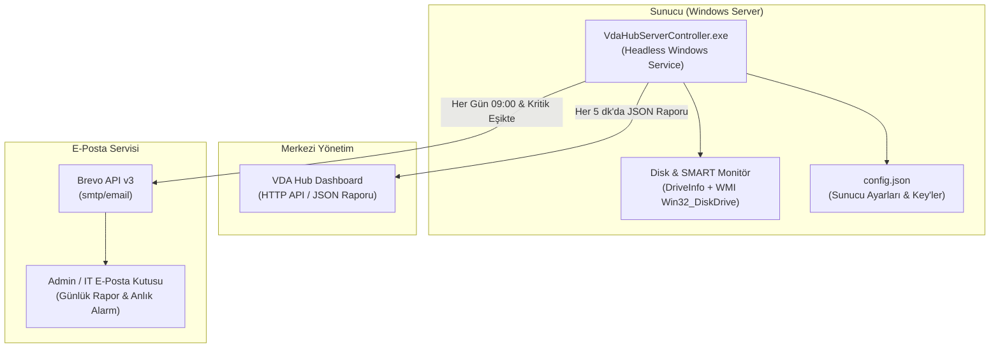

# VDA Hub Server Controller

**VDA Hub Server Controller**, Windows sunucularındaki disk/CPU/RAM durumunu merkezi **VDA Hub** paneline aktaran ve Hub'dan manuel tetiklenen tam Dropbox snapshot yedeklerini çalıştıran self-contained Windows ajanıdır.

---

## 🚀 Temel Özellikler

- **📁 Ayrıntılı Disk & Kapasite Takibi:** Mantıksal sürücülerin toplam boyutu, boş alanı, kullanılan alanı, doluluk yüzdesi ve dosya sistemi (NTFS, ReFS vb.).
- **💽 Fiziksel Disk & SMART Sağlık Denetimi:** WMI üzerinden fiziksel disk modeli, seri numarası, arayüz türü (NVMe/SCSI/SATA), disk türü ve SMART arıza tahmini.
- **🌐 VDA Hub Entegrasyonu:** Merkezi Hub API'sine (`POST /api/v1/servers/report`) JSON formatında periyodik durum aktarımı (Bearer Token / X-API-Key destekli).
- **🔑 Generic EXE eşleştirmesi:** Aynı EXE bütün sunucularda kullanılır; ilk açılışta Hub'ın tek kullanımlık Kurulum Anahtarı girilir.
- **☁️ Manuel tam Dropbox snapshot:** Agent'ın uygulama içi seçicisinden veya Hub'dan kaydedilen klasörleri iki yönlü eşitler; yalnız Hub'daki **YEDEKLE** komutuyla bütün dosyaları `VDAKor Hub/VDA Backups/Sunucu/Tarih` altına yükler. Zamanlama ve otomatik silme yoktur.
- **📦 Hızlı ZIP64 modu:** Önerilen modda her seçili klasörü ayrı ZIP64 arşivine dönüştürür, manifest üretir, geçici disk alanını önceden denetler ve Dropbox API istek sayısını azaltır. Harici 7-Zip kurulumu gerekmez; ayrı-dosya modu da seçilebilir.
- **📈 Canlı yedekleme ilerlemesi:** Tarama, hazırlık, sıkıştırma, yükleme ve tamamlama aşamalarını; dosya ve bayt sayaçlarını Hub'a periyodik olarak bildirir.
- **⏹️ Güvenli uzaktan durdurma:** Hub'daki durdurma isteğini sıkıştırma/yükleme parçası sınırında uygular; yerel geçici ZIP'leri ve yarım Dropbox staging klasörünü temizler.
- **✉️ Brevo (Sendinblue) E-Posta Raporlama:**
  - **Günlük Durum Bülteni:** Her sabah belirlenen saatte (örn. `09:00`) sunucunun tüm disk durumunu renkli ilerleme çubukları ve sağlık rozetleri içeren modern HTML formatında e-posta olarak iletir.
  - **Kritik Eşik Alarmı:** Disk doluluğu kritik seviyeyi (örn. `%90`) aştığında veya SMART arıza uyarısı alındığında anında acil durum uyarısı gönderir.
  - **Aç/Kapat (Toggle) Opsiyonu:** Brevo e-posta gönderimi arayüzden veya konfigürasyondan tek tıkla açılıp kapatılabilir.
- **🛡️ Headless çalışma:** İlk eşleştirme veya elle ayar açılışı dışında sürekli GUI yoktur. Ajan taskbar/system-tray ikonu göstermeyen otomatik Windows servisi olarak çalışır.
- **♻️ Güvenli servis geçişi:** Aynı adlı doğrulanmış eski VDAKor servisini durdurur, kaldırır ve yeni EXE ile yeniden oluşturur; yabancı servis görülürse işlem yapmaz.
- **⌨️ CLI:** Terminal üzerinden test ve yönetim desteği.
- **📦 Tek Bağımsız Dosya (.exe):** Sunucuda .NET veya ek hiçbir runtime kurulu olmasına gerek yoktur. Tek bir `.exe` dosyası olarak çalıştırılabilir.

---

## 🏗️ Mimari & Çalışma Şeması



---

## 🛠️ Kurulum ve Çalıştırma

### 1. Generic EXE ile eşleştirme

1. Hub > **Sunucular** ekranında Windows sunucu kaydını açıp tek kullanımlık Kurulum Anahtarını alın.
2. `VdaHubServerController.exe` dosyasını yönetici olarak açın.
3. Hub adresini ve Kurulum Anahtarını girin.
4. Eşleştirmeden sonra EXE kendisini `%ProgramData%\VDAKor\ServerAgent` altında otomatik Windows servisi olarak kurar ve kapanır.

Servis kullanıcı oturumu olmasa da çalışır; taskbar veya sistem tepsisinde ikon göstermez. EXE sonradan çift tıklanırsa geçici ayar ekranı açılır; pencere kapandığında yalnız ayar uygulaması kapanır, servis devam eder.

Yedekleme sekmesindeki **Klasör Ekle** düğmesi sunucunun sürücülerini uygulama içinde, arayüzü kilitlemeden listeler. Kaydedilen yollar ve **Arşivleyerek yükle** tercihi Hub'daki aynı sunucu kaydına yazılır ve Hub sayfası yenilendiğinde görünür. Hub'da kaydedilen ayarlar da agent ekranı yeniden açıldığında yüklenir.

Ana ekrandaki durum rozeti, **Şimdi Tara** ve **Ayarları Kapat** kontrolleri DPI veya pencere genişliği değişse de sağ üstte görünür kalır. **Şimdi Tara** mantıksal sürücüleri ve fiziksel disk/SMART bilgisini anında yeniler.

Kalıcı API anahtarı elle düzenlenmez. Sunucuyu başka veya yenilenmiş bir Hub anahtarıyla bağlamak için Hub'da mevcut sunucu kaydından yeni `vda_setup_...` Kurulum Anahtarı üretip Ayarlar'daki **Yeniden Eşleştir** düğmesini kullanın; başarılı işlemden sonra headless servis yeni anahtarla yeniden başlatılır.

---

## ⚙️ Konfigürasyon (`config.json`)

Uygulama ilk çalıştığında otomatik olarak `config.json` dosyasını oluşturur. Dilerseniz arayüz üzerinden, dilerseniz doğrudan bu dosyayı düzenleyerek ayarları yapabilirsiniz:

```json
{
  "ServerId": "fd591f87-7bf9-44bd-94b7-4b15c6479f1d",
  "ServerName": "Production-DB-01",
  "CheckIntervalMinutes": 5,
  "Hub": {
    "Enabled": true,
    "HubApiUrl": "https://hub.sirketiniz.com/api/v1/servers/report",
    "ApiKey": "vda_hub_secret_token_123",
    "TimeoutSeconds": 15
  },
  "Brevo": {
    "Enabled": true,
    "ApiKey": "xkeysib-YOUR_BREVO_API_KEY",
    "SenderEmail": "server-alerts@sirketiniz.com",
    "SenderName": "VDA Hub Controller",
    "RecipientEmails": "admin@sirketiniz.com, sysadmin@sirketiniz.com",
    "DailyReportTime": "09:00",
    "SendCriticalAlertImmediately": true,
    "WarningThresholdPercent": 80,
    "CriticalThresholdPercent": 90
  }
}
```

---

## ✉️ Brevo Entegrasyonu Nasıl Yapılır?

1. [Brevo](https://www.brevo.com/) hesabınıza giriş yapın.
2. Sağ üstteki profil menüsünden **SMTP & API** sekmesine gidin.
3. Yeni bir **API Key (v3)** oluşturun (`xkeysib-...` ile başlar).
4. `config.json` dosyasında veya uygulama arayüzündeki **Ayarlar** sekmesinde:
   - **Brevo E-Posta Bildirimlerini Etkinleştir** seçeneğini işaretleyin.
   - API Key'inizi, onaylanmış Gönderen E-postanızı ve Alıcı adreslerini girin.
   - **"Brevo Test Maili Gönder"** butonuna tıklayarak bağlantıyı hemen doğrulayın.

---

## 💻 Komut Satırı (CLI) Parametreleri

| Parametre | Açıklama |
|---|---|
| `(parametre yok)` | İlk çalıştırmada eşleştirir; sonrasında geçici ayar penceresini açar. |
| `--service` | Headless Windows Servisi modunda çalışır. |
| `--install-service` | Uygulamayı Windows Servisi olarak kaydeder (Otomatik başlatma). |
| `--uninstall-service`| Kurulu servisi sistemden kaldırır. |
| `--start-service` | Kurulu servisi başlatır. |
| `--stop-service` | Çalışan servisi durdurur. |
| `--run-once` | Diskleri anlık olarak tarar, konsola özet yazar ve çıkar. |
| `--test-mail` | Brevo API üzerinden test e-postası gönderir. |
| `--test-hub` | VDA Hub uç noktasına test raporu gönderir. |
| `--backup-now` | Hub'da bekleyen manuel snapshot komutunu çalıştırır. |
| `--help`, `-h` | Komut satırı yardım menüsünü görüntüler. |

---

## 🔨 Kaynak Koddan Derleme (Build)

Tek bir bağımsız `.exe` oluşturmak için:

```powershell
# PowerShell ile:
.\build.ps1

# veya Batch dosyasıyla:
build.bat
```

Derleme sonucunda `./publish/` klasörü içinde ~50 MB boyutunda tüm .NET bağımlılıklarını içinde barındıran, harici kurulum gerektirmeyen `VdaHubServerController.exe` hazır hale gelir.
